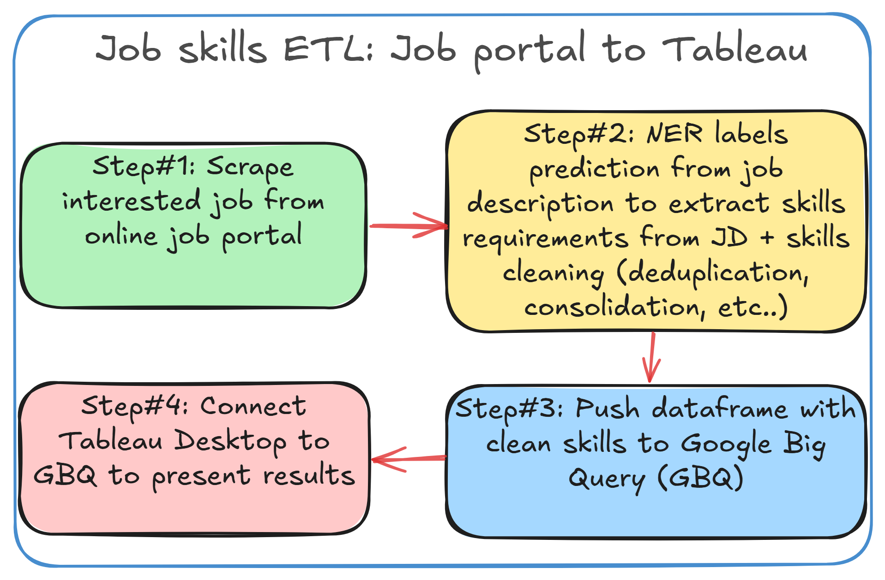

# Job skills identifier
This project aims to analyze recent job postings in Singapore to identify in-demand skills extracted from job descriptions for a given role. 

The project consists of the following components:
1. Online job portal web scraping (using [JobSpy](https://github.com/Bunsly/JobSpy))
2. NER zero-shot labels prediction for skills extraction (using [Hugging Face GliNER](https://huggingface.co/urchade/gliner_large-v2.1))
3. Data cleaning and visualization (using simple Python functions and viz library)
4. Storing the data (including extracted and cleansed skills) in a Google Big Query Database (using GBQ Pandas library)
5. The end destination is a Tableau dashboard that shows the most in-demand skills for a given role in Singapore. Since this step cannot be done using Tableau's Public version, the dashboard is not included in this repository. But below image (created using Python Matplotlib) shows the top 10 skills for a Data Engineer role in Singapore.